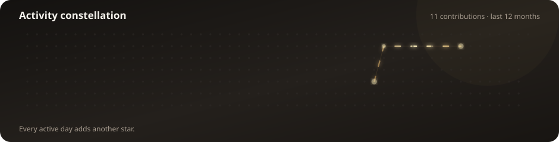

# Hi, I’m Rohan 👋

### I build practical web, mobile and cloud projects—and enjoy turning ideas into polished experiences.

## ✨ Activity constellation

Each star represents a day of GitHub activity. Brighter stars mean more contributions, while the animated trail connects active days into a constellation unique to my work.

  

## About me

- 🌐 Building responsive web experiences with **HTML, CSS, JavaScript and TypeScript**
- 📱 Exploring Android development with **Kotlin and Jetpack Compose**
- ☁️ Interested in **AWS, Node.js, Express and deployment workflows**
- 🎨 I care about thoughtful design, accessibility and clear user experiences
- 🚀 Currently improving and publishing real-world portfolio projects

## Technologies

  
  
  
  
  
  
  
  

## Featured work

### [Aboriginal Headstones Page](https://github.com/RohanSubba7/Aboriginal-Headstones-Page)

A responsive standalone memorial-design guide featuring custom layouts, accessible tables, original imagery and subtle animated details.

### [Employee Management System](https://github.com/RohanSubba7/Employee-Management-System)

An employee-management project built with Kotlin.

### [Tic-Tac-Toe](https://github.com/RohanSubba7/tictactoe)

A TypeScript implementation of the classic game.

---

  The activity constellation refreshes automatically every day.

